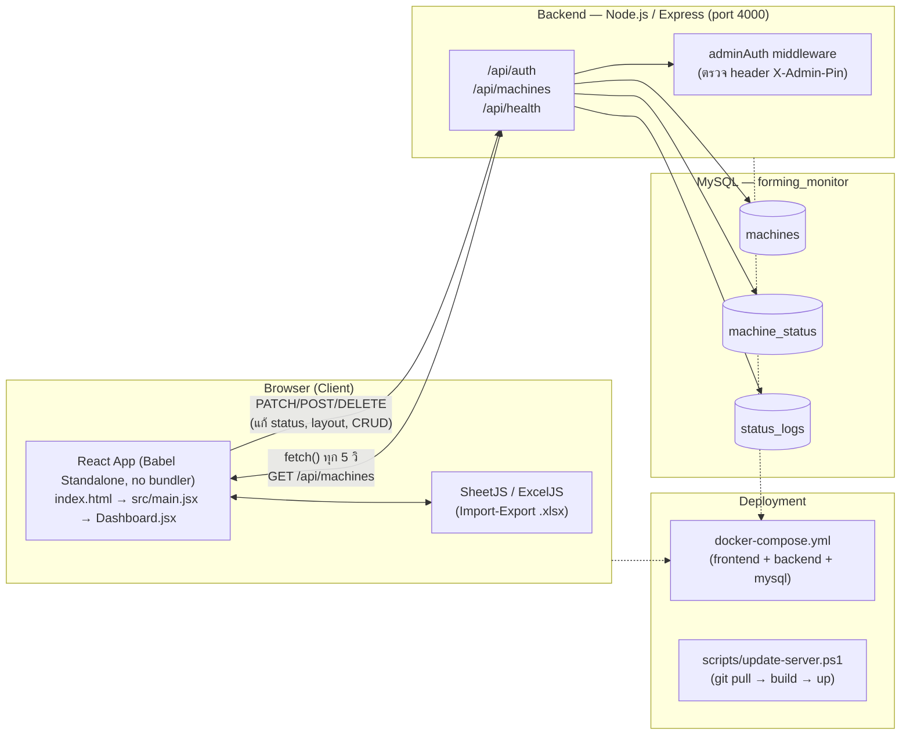
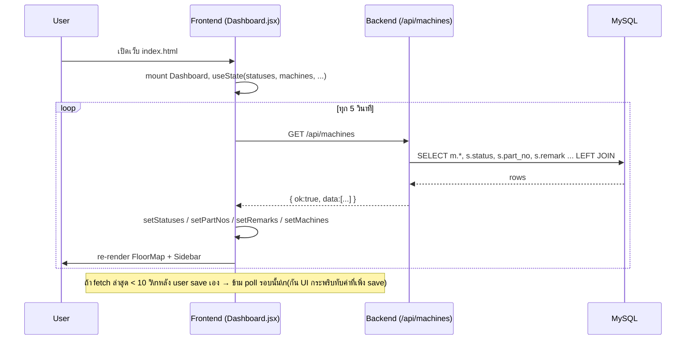
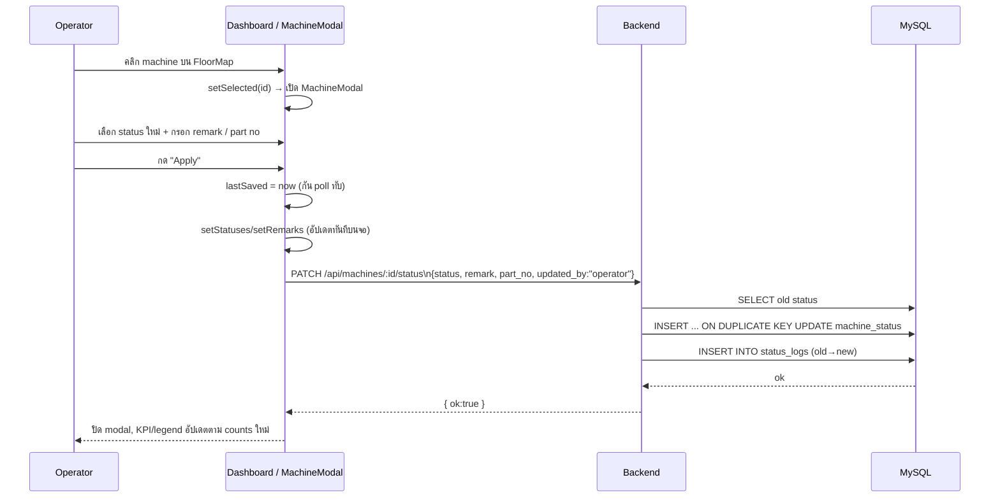
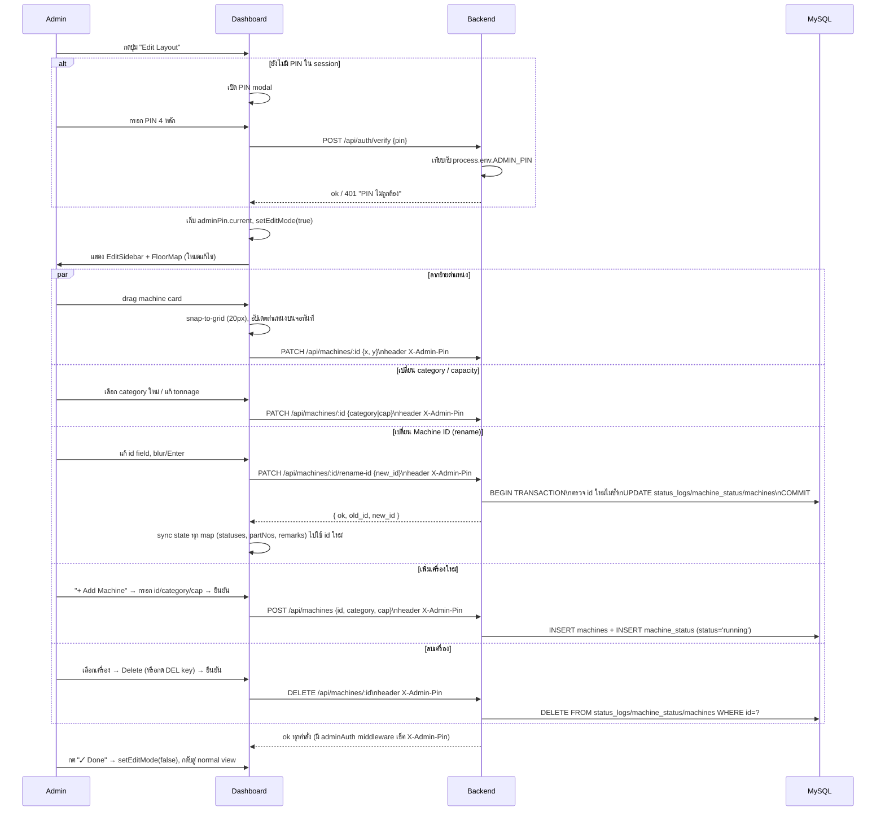
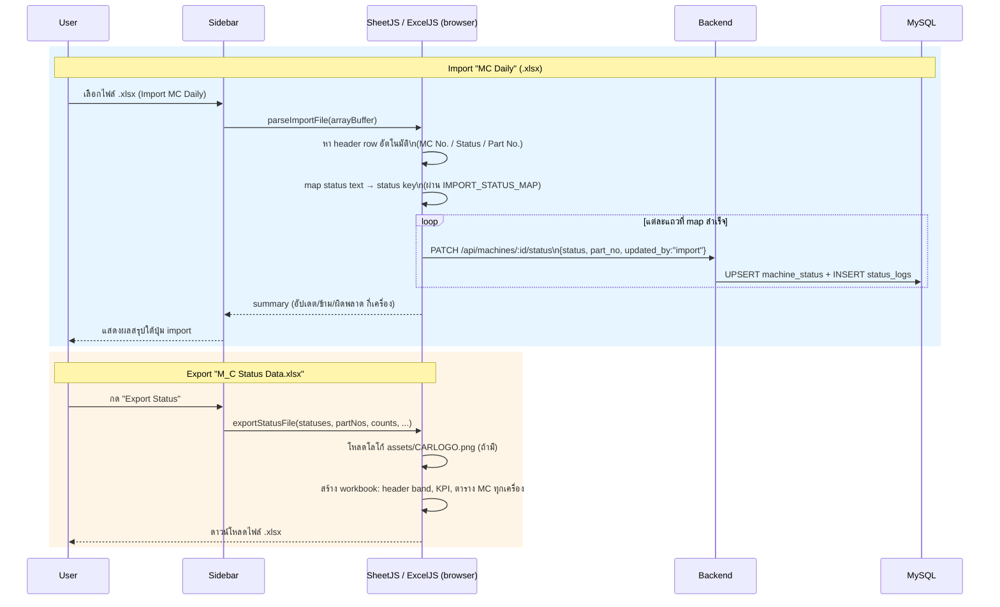
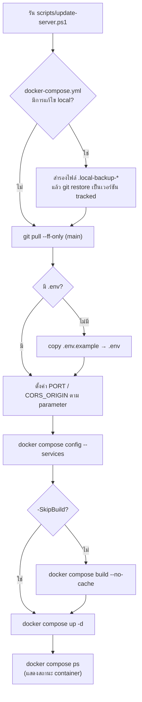

# Forming Monitor — Workflow

เอกสารนี้สรุปขั้นตอนการทำงาน (workflow) ของระบบ Forming Operations Monitor
ตั้งแต่สถาปัตยกรรมโดยรวม ไปจนถึง flow การใช้งานหลักแต่ละจุด

---

## 1. ภาพรวมสถาปัตยกรรม (Architecture Overview)

**ส่วนประกอบหลัก**
- **Frontend** — Static site (`index.html`, `src/**`) โหลดผ่าน HTTP server, ไม่มี build step (Babel แปลง JSX ใน browser)
- **Backend** — Express API คุยกับ MySQL ผ่าน `mysql2/promise` connection pool
- **Database** — ตาราง `machines` (ข้อมูลเครื่องจักร/ตำแหน่ง), `machine_status` (สถานะปัจจุบัน), `status_logs` (ประวัติการเปลี่ยนสถานะ)
- **Auth** — ใช้ PIN เดียว (`ADMIN_PIN` ใน `.env`) ตรวจผ่าน `/api/auth/verify` และ header `X-Admin-Pin`

---

## 2. โหลดหน้า Dashboard + Live Polling

---

## 3. Operator เปลี่ยนสถานะเครื่องจักร

---

## 4. Edit Layout Mode (Admin)

---

## 5. Import / Export ข้อมูลผ่าน Excel

---

## 6. Deploy / Update Server

---

## สรุปไฟล์สำคัญที่เกี่ยวข้องกับแต่ละ workflow

| Workflow | ไฟล์หลัก |
|---|---|
| Live polling / state | `src/components/Dashboard.jsx` |
| แก้ไขสถานะเครื่อง | `src/components/MachineModal.jsx`, `src/utils/api.js`, `backend/src/routes/machines.js` |
| Edit Layout / Admin | `src/components/Dashboard.jsx` (`EditSidebar`), `src/components/EditPage.jsx`, `backend/src/middleware/adminAuth.js`, `backend/src/routes/auth.js` |
| Import/Export Excel | `src/components/Sidebar.jsx`, `src/utils/parseImportFile.js`, `src/utils/excel.js` |
| Database schema/seed | `scripts/sync_server_db.sql` (local-only, gitignored) |
| Deploy | `docker-compose.yml`, `scripts/update-server.ps1`, `.env.example` |
